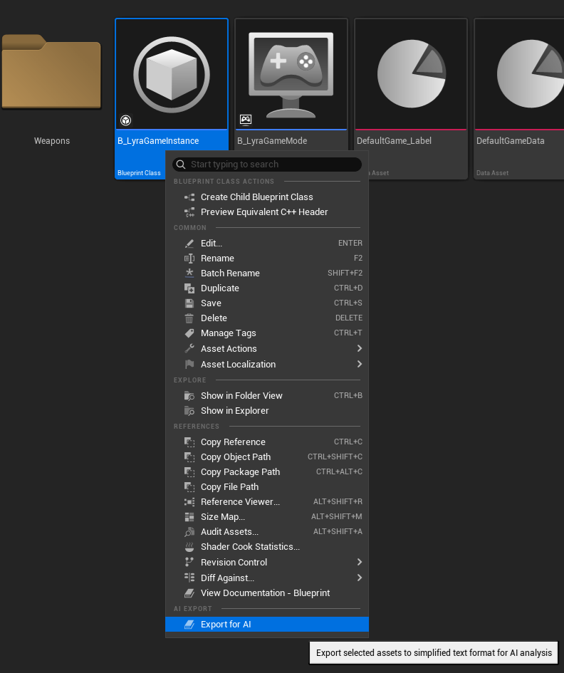

# CommonAIExport

Export Unreal Engine assets to simplified text format for AI analysis.

## Getting Started

### Step 1: Install Plugin
Copy the `CommonAIExport` folder to your project's `Plugins/` directory and rebuild the project.

### Step 2: Launch Unreal Editor
Start your Unreal Engine project. **The editor must remain open** during the export process - the TCP server runs inside the editor.

### Step 3: Configure Your AI Assistant
Tell your AI assistant to read the `Docs/Usage/AI_QUICKSTART.md` file in this plugin. This file contains:
- How to connect to the TCP server
- Available export commands
- Output path conventions

For UI transfer or Widget Blueprint mutation work, also read
`Docs/AI_UI_Transfer/README.md`. The plugin includes a portable TSpec workflow under
`Docs/UI_TSpec/` and `Docs/AI_UI_Transfer/`; validate specs before WBP mutation
with:

```powershell
powershell -ExecutionPolicy Bypass -File Resources/Scripts/ValidateUITSpecs.ps1
```

### Step 4: Customize Settings (Optional)
Open **Project Settings → Plugins → Common AI Export** to configure:
- Output directory
- Export mode (Raw/Simplified/Both)
- Python path

### Step 5: Manual Export (Alternative)
You can also export assets directly from the editor without AI:
1. Right-click any asset in Content Browser
2. Select **"Export for AI"**
3. Find the output in `Dev/AIExports/`



## Overview

CommonAIExport converts UE assets into text format that AI assistants can read and understand. It works as a C++ and Python hybrid system: C++ exports assets to raw text, Python scripts simplify this text for AI consumption.

**Requirements:**
- Unreal Engine 5.x
- Python 3.x (for simplification)

## System Architecture

```
┌─────────────────┐     ┌──────────────────┐     ┌──────────────────┐     ┌─────────────────┐
│   UE Asset      │────▶│  C++ Exporter    │────▶│  C++ Exporter    │────▶│  Python         │
│  (Blueprint,    │     │  (_raw.txt)      │     │  (_stripped.txt) │     │  Simplifier     │
│   Widget, etc)  │     │  All properties  │     │  Non-default     │     │  (_simplified)  │
└─────────────────┘     └──────────────────┘     │  UE text format  │     │  AI-ready       │
        │                                         └──────────────────┘     └─────────────────┘
        │                                                                         │
   Context Menu                                                              AI Assistant
   "Export for AI"                                                           reads & understands
```

### Export Formats (3-Tier)

| Format | Suffix | Producer | Content | Best For |
|--------|--------|----------|---------|----------|
| **Raw** | `_raw.txt` | C++ exporter | ALL property values including defaults, GUIDs, node positions, internal UE metadata | Debugging the export pipeline |
| **Stripped** | `_stripped.txt` | C++ exporter (archetype-filtered) | Only non-default values, but still in UE serialization format (`Begin Object`, `CustomProperties Pin(...)`) | Exact pin types, transition conditions, full AnimGraph node properties |
| **Simplified** | `_simplified.txt` | Python post-processor | Human/AI-readable restructured output: widget trees, node flow chains, clean key=value properties | General AI analysis — **start here** |

Raw export uses C++ `Property->Identical_InContainer` archetype comparison to detect non-default values.
Stripped is the raw output with default-valued properties removed.
Simplification is done by Python scripts that restructure stripped data into AI-friendly format.

## Plugin Structure (v4.0 - Modular Architecture)

```
CommonAIExport/
├── CommonAIExport.uplugin
├── README.md                            # This file
├── Source/CommonAIExport/
│   ├── Public/
│   │   ├── AIExportFunctionLibrary.h    # Thin facade (delegates to exporters)
│   │   ├── AIExportCommandlet.h         # Headless export
│   │   ├── AIExportSettings.h           # Editor settings
│   │   ├── AIExportContextMenu.h        # Context menu
│   │   ├── AIExportTCPServer.h          # TCP server for AI tools
│   │   ├── AIExporterRegistry.h         # Exporter management (singleton)
│   │   ├── CommonAIExportModule.h       # Module interface
│   │   └── Exporters/                   # Modular exporters (Strategy Pattern)
│   │       ├── AIExporterBase.h         # Abstract base class
│   │       ├── AIBlueprintExporter.h    # UBlueprint (Priority: 50)
│   │       ├── AIWidgetBlueprintExporter.h  # UWidgetBlueprint (Priority: 100)
│   │       ├── AIDataAssetExporter.h    # UDataAsset (Priority: 40)
│   │       ├── AIInputExporter.h        # InputAction/IMC (Priority: 50)
│   │       ├── AIAudioExporter.h        # Audio assets (Priority: 50)
│   │       ├── AIWorldExporter.h        # UWorld/Map (Priority: 50)
│   │       ├── AIPhysicalMaterialExporter.h  # PhysicalMaterial (Priority: 46)
│   │       ├── AIMaterialExporter.h     # Material/MaterialInstance (Priority: 45)
│   │       └── AITextureExporter.h      # Texture assets (Priority: 50)
│   └── Private/
│       ├── AIExportFunctionLibrary.cpp
│       ├── AIExportCommandlet.cpp
│       ├── AIExportSettings.cpp
│       ├── AIExportContextMenu.cpp      # Right-click menu
│       ├── AIExportTCPServer.cpp        # TCP server implementation
│       ├── AIExporterRegistry.cpp       # Exporter registration
│       ├── CommonAIExportModule.cpp
│       └── Exporters/                   # Exporter implementations
│           ├── AIExporterBase.cpp       # Common helpers (property/graph export)
│           ├── AIBlueprintExporter.cpp
│           ├── AIWidgetBlueprintExporter.cpp
│           ├── AIDataAssetExporter.cpp
│           ├── AIInputExporter.cpp
│           ├── AIAudioExporter.cpp
│           ├── AIWorldExporter.cpp      # Map/World export
│           ├── AIPhysicalMaterialExporter.cpp  # PhysicalMaterial export
│           ├── AIMaterialExporter.cpp   # Material/MaterialInstance export
│           └── AITextureExporter.cpp    # Texture export
└── Resources/
    └── Scripts/                         # Python simplifier scripts
        ├── simplify_asset.py            # Main dispatcher (detects asset type)
        ├── bp_simplify.py               # Blueprint simplifier
        ├── animbp_simplify.py           # Animation Blueprint simplifier
        ├── widget_simplify.py           # Widget Blueprint simplifier
        ├── dataasset_simplify.py        # DataAsset simplifier
        ├── input_simplify.py            # Input Action/Context simplifier
        ├── ability_simplify.py          # Gameplay Ability simplifier
        ├── material_simplify.py         # Material/MaterialInstance simplifier
        ├── export_asset.py              # Export utility script
        └── ai_export_client.py          # TCP client for AI tools
```

### Modular Exporter Architecture (v4.0)

The plugin uses a **Strategy Pattern with Registry** for extensible asset export:

```
┌─────────────────────────────────────────────────────────────────┐
│                    AIExporterRegistry (Singleton)               │
│  ┌─────────────────────────────────────────────────────────┐    │
│  │  FindExporterForAsset(Asset) -> UAIExporterBase*        │    │
│  │  Checks exporters by priority (highest first)           │    │
│  └─────────────────────────────────────────────────────────┘    │
│                              │                                   │
│   ┌──────────────────────────┼──────────────────────────────┐   │
│   │                          │                              │   │
│   ▼                          ▼                              ▼   │
│ ┌─────────────┐  ┌─────────────────────┐  ┌──────────────────┐ │
│ │WidgetBP     │  │ Blueprint Exporter  │  │ World Exporter   │ │
│ │ Priority:100│  │ Priority: 50        │  │ Priority: 50     │ │
│ └─────────────┘  └─────────────────────┘  └──────────────────┘ │
│       ▲                      ▲                      ▲          │
│       └──────────────────────┴──────────────────────┘          │
│                   All inherit UAIExporterBase                   │
└─────────────────────────────────────────────────────────────────┘
```

**Adding a New Exporter:**

1. Create class inheriting `UAIExporterBase`
2. Implement: `CanExport()`, `GetSupportedClasses()`, `Export()`, `GetPriority()`
3. Register in `AIExporterRegistry::RegisterDefaultExporters()`

## Python Simplifier System

### How It Works

1. **C++ Export:** Exports asset to raw text format
2. **Python Dispatch:** `simplify_asset.py` analyzes content and detects asset type
3. **Type-Specific Simplify:** Appropriate simplifier script is called (e.g., `bp_simplify.py`)
4. **Output:** Simplified `_simplified.txt` file is created

### Simplifier Scripts

| Script | Asset Type | What It Does |
|--------|------------|--------------|
| `bp_simplify.py` | Blueprint | Parses nodes, removes GUID/position |
| `widget_simplify.py` | Widget Blueprint | Simplifies widget tree |
| `animbp_simplify.py` | Anim Blueprint | Parses state machines |
| `dataasset_simplify.py` | DataAsset, PhysicalMaterial | Cleans properties |
| `input_simplify.py` | Input Action/Context | Simplifies bindings |
| `ability_simplify.py` | Gameplay Ability | Cleans ability configs |
| `material_simplify.py` | Material/MaterialInstance | Simplifies material graph |

## Usage

### Context Menu (In Editor)

1. Select asset in Content Browser
2. Right-click → **"Export for AI"**
3. Outputs appear in `Dev/AIExports/` folder

### Commandlet (Headless)

```powershell
UnrealEditor-Cmd.exe "Project.uproject" -run=AIExport -asset="/Game/UI/W_Menu" -both -nullrhi -unattended -nosplash -nopause
```

#### Parameters

| Parameter | Description |
|-----------|-------------|
| `-asset=<path>` | Asset path to export |
| `-raw` | Raw export only (Python not called) |
| `-simplified` | Simplified export only (raw deleted) |
| `-both` | Both formats |
| `-output=<path>` | Output folder (default: Dev/AIExports) |

## Supported Asset Types

| Asset Type | Exporter Class | Priority | Status |
|------------|----------------|----------|--------|
| Widget Blueprint | `UAIWidgetBlueprintExporter` | 100 | ✅ |
| Animation Blueprint | `UAIAnimBlueprintExporter` | 90 | ✅ |
| Blueprint | `UAIBlueprintExporter` | 50 | ✅ |
| World/Map | `UAIWorldExporter` | 50 | ✅ |
| Input Action | `UAIInputExporter` | 50 | ✅ |
| Input Mapping Context | `UAIInputExporter` | 50 | ✅ |
| Audio (SoundClass, etc.) | `UAIAudioExporter` | 50 | ✅ |
| Texture | `UAITextureExporter` | 50 | ✅ |
| **PhysicalMaterial** | `UAIPhysicalMaterialExporter` | 46 | ✅ **NEW** |
| Material/MaterialInstance | `UAIMaterialExporter` | 45 | ✅ |
| DataAsset | `UAIDataAssetExporter` | 40 | ✅ |

> **Priority:** Higher values are checked first. WidgetBlueprint (100) takes precedence over generic Blueprint (50).

### World/Map Export (v4.0)

`UAIWorldExporter` exports UWorld (Map/Level) assets with:

- **World Metadata**: Name, type, path, level count, actor count
- **World Settings**: Standard settings + **Custom Properties** (non-default values like DefaultGameplayExperience)
- **Streaming Levels**: Package names, load/visible states, transforms
- **Actors**: Grouped by class, with location/rotation/scale, tags, and **Custom** non-default properties

**Key Feature**: Simplified export includes all non-default properties needed to recreate the map.

Example output (simplified):
```
=== WORLD: L_LyraFrontEnd ===
WorldType: Inactive
Path: /Game/System/FrontEnd/Maps/L_LyraFrontEnd
PersistentLevel: PersistentLevel
LevelCount: 1
ActorCount: 8

=== WORLD SETTINGS ===
bEnableWorldBoundsChecks: True
bEnableWorldComposition: False
KillZ: -1048575.00
WorldGravityZ: 0.00
GlobalGravityZ: 0.00

--- Custom Properties ---
DefaultGameplayExperience=/Game/System/FrontEnd/B_LyraFrontEnd_Experience.B_LyraFrontEnd_Experience_C
ForceStandaloneNetMode=True
bEnableNavigationSystem=False

=== ACTORS ===

--- CameraActor (1) ---
  [CameraActor_4]
    Location: (-50.0, 0.0, 0.0)
    Custom:
      AutoActivateForPlayer=Player0
      CameraComponent=CameraComponent

--- LyraPlayerStart (1) ---
  [PlayerStart_1]
    Location: (-1000.0, 0.0, -558.0)
    Custom:
      ArrowComponent=Arrow
      CapsuleComponent=CollisionCapsule

--- StaticMeshActor (2) ---
  [StaticMeshActor_0]
    Location: (10.0, 0.0, 0.0)
    Rotation: (0.0, 90.0, 90.0)
    Scale: (2.00, 1.00, 1.00)
    Custom:
      StaticMeshComponent=StaticMeshComponent0
```

**What AI Can Understand From Simplified Export:**
- Which Experience asset to use (`DefaultGameplayExperience`)
- Network mode (`ForceStandaloneNetMode`)
- Navigation settings (`bEnableNavigationSystem`)
- Actor positions, rotations, scales
- Actor-specific configurations (camera auto-activate, components)

### Audio Asset Support

Audio Foundation asset export desteği (v3.4).

| Asset Type | UE Class | Key Properties | Status |
|------------|----------|----------------|--------|
| SoundClass | `USoundClass` | Volume, Pitch, bAlwaysPlay, bReverb, DefaultSubmix, ParentClass, ChildClasses | ✅ |
| SoundSubmix | `USoundSubmix` | ParentSubmix, bAutoDisable, OutputVolume, Effects | ✅ |
| SoundConcurrency | `USoundConcurrency` | MaxCount, ResolutionRule, bLimitToOwner | ✅ |
| SoundAttenuation | `USoundAttenuation` | DistanceAlgorithm, FalloffDistance, bSpatialize | ✅ |
| SoundControlBus | `USoundControlBus` | Address, bBypass | ✅ |
| SoundControlBusMix | `USoundControlBusMix` | MixStages | ✅ |
| SoundModulationPatch | `USoundModulationPatch` | Inputs, OutputParameter | ✅ |

## Output Format Examples

### Widget Blueprint (Simplified)

```
=== WIDGET BLUEPRINT: W_SinglePlayerSetup ===

=== WIDGET TREE ===
- RootCanvas (CanvasPanel)
  - Background (Image)
  - MainLayout (VerticalBox)
    - Header (HorizontalBox)
      - BackButton (Button)
        - BackButtonText (TextBlock)

=== BLUEPRINT: W_SinglePlayerSetup ===
ParentClass: OkeySinglePlayerSetup

=== CLASS DEFAULTS ===
bSkipLobby=True
CurrentSettings=(BotCount=3,BotDifficulty=Medium)
```

### DataAsset (Simplified)

```
=== DATA ASSET: DA_GameRules ===
Class: OkeyGameRulesData

=== PROPERTIES ===
MaxPlayers=4
TurnTimeLimit=30
TargetScore=101
bEnableOkey=True
```

### PhysicalMaterial (Simplified)

```
=== PHYSICAL MATERIAL: PhysMat_Player ===
Class: PhysicalMaterialWithTags

=== PROPERTIES ===
Tags=()
Friction=1.000000
StaticFriction=1.000000
Restitution=0.000000
Density=1.000000
SurfaceType=SurfaceType1
Strength=(TensileStrength=2.000000,CompressionStrength=20.000000,ShearStrength=6.000000)
DamageModifier=(DamageThresholdMultiplier=1.000000)
```

**Note:** PhysicalMaterial export uses reflection-based `ExportObjectProperties()`, so subclass-specific fields (e.g., `Tags` from `UPhysicalMaterialWithTags`) are included automatically without compile-time dependencies on the subclass module.

### DataAsset with Embedded Objects (v4.1.0+)

For DataAssets containing embedded/instanced subobjects (like GameFeatureActions), the deep export provides full property paths:

```
=== DATA ASSET: AS_StandardOkey_Components ===
Class: OkeyExperienceActionSet
Inheritance: PrimaryDataAsset

=== PROPERTIES ===
Actions[0]=GameFeatureAction_AddComponents_0 (GameFeatureAction_AddComponents)
Actions[0].ComponentList[0].ActorClass=/Script/OkeyGame.OkeyGameState
Actions[0].ComponentList[0].ComponentClass=/Script/OkeyGame.OkeyTurnManagerComponent
Actions[0].ComponentList[0].bClientComponent=True
Actions[0].ComponentList[0].bServerComponent=True
Actions[0].ComponentList[1].ActorClass=/Script/OkeyGame.OkeyGameState
Actions[0].ComponentList[1].ComponentClass=/Script/OkeyGame.OkeyRoundManagerComponent
Actions[0].ComponentList[1].bClientComponent=True
Actions[0].ComponentList[1].bServerComponent=True
```

**What AI Can Understand:**
- Which components are added by this ActionSet
- Target actor class for each component (`ActorClass`)
- The component class to spawn (`ComponentClass`)
- Network replication settings (`bClientComponent`, `bServerComponent`)

### SoundClass

```
=== SOUND_CLASS: SC_Music ===
ParentClass: /Game/Audio/Classes/SC_Overall.SC_Overall
ChildClassCount: 0

=== KEY SETTINGS ===
Volume: 1.00
Pitch: 1.00
bAlwaysPlay: True
bReverb: False
bApplyAmbientVolumes: True
DefaultSubmix: /Game/Audio/Submixes/SM_MusicSubmix.SM_MusicSubmix

=== PROPERTIES ===
Properties=(Volume=1.0,Pitch=1.0,bAlwaysPlay=True,...)
ParentClass=/Script/Engine.SoundClass'/Game/Audio/Classes/SC_Overall.SC_Overall'
```

### Animation Blueprint (Simplified)

```
=== ANIM BLUEPRINT: ABP_Mannequin_Base ===
ParentClass: LyraAnimInstance
TargetSkeleton: SK_Mannequin

=== INTERFACES ===
ALI_ItemAnimLayers
  - FullBodyAdditives
  - FullBody_IdleState
  - FullBody_StartState
  - FullBody_CycleState
  - FullBody_Aiming
  - FullBody_SkeletalControls
  - LeftHandPose_OverrideState

=== CLASS DEFAULTS ===
AnimGraphNode_ApplyAdditive=(Alpha=0.650000,AlphaCurveName="applyDynamicAdditive",
    AlphaScaleBiasClamp=(InterpSpeedIncreasing=4.0,InterpSpeedDecreasing=4.0))
AnimGraphNode_LegIK=(AlphaInputType=Curve,AlphaCurveName="DisableLegIK")
AnimGraphNode_ModifyBone=(AlphaCurveName="ScaleDownWeaponR")

=== STATE MACHINE: LocomotionSM ===
STATES:
  [State] Idle
  [State] Start
  [State] Cycle
  [State] Stop
  [State] Pivot
TRANSITIONS:
  Idle -> Start (Condition: ShouldMove)
  Start -> Cycle
  Cycle -> Stop (Condition: ShouldStop)
  ...

=== GRAPH: UpdateIdleAnim ===
[K2Node_FunctionEntry] -> [K2Node_Select] -> [K2Node_CallFunction] -> [K2Node_FunctionResult]
```

**AnimBlueprint Export Features:**
- Parent class (if derived from custom AnimInstance)
- Implemented interfaces with function list
- Alpha, AlphaCurveName, AlphaInputType values
- InterpSpeed values (InterpSpeedIncreasing/Decreasing)
- State machine structure with states and transitions
- Blueprint function graphs

## Cross-Project Usage

CommonAIExport can be used in other projects:

1. Copy plugin folder to target project's `Plugins/` directory
2. Recompile project
3. Ensure Python is installed on the system
4. Export assets
5. Give simplified files to your AI assistant

## API Reference

### UAIExporterRegistry (v4.0 - NEW)

```cpp
// Get singleton instance
static UAIExporterRegistry* Get();

// Find appropriate exporter for asset (checks by priority)
UAIExporterBase* FindExporterForAsset(UObject* Asset) const;

// Check if any exporter can handle this asset
bool IsAssetSupported(UObject* Asset) const;

// Get all supported asset classes
TArray<UClass*> GetAllSupportedClasses() const;

// Register a new exporter
void RegisterExporter(TSubclassOf<UAIExporterBase> ExporterClass);
```

### UAIExporterBase (Abstract)

```cpp
// Can this exporter handle the asset?
virtual bool CanExport(UObject* Asset) const PURE_VIRTUAL;

// Get list of supported classes
virtual TArray<UClass*> GetSupportedClasses() const PURE_VIRTUAL;

// Export asset to string
virtual FString Export(UObject* Asset, bool bFilterDefaults = false) PURE_VIRTUAL;

// Priority (higher = checked first)
virtual int32 GetPriority() const { return 50; }

// Display name for logging
virtual FString GetExporterDisplayName() const;
```

### UAIExportFunctionLibrary (Facade)

```cpp
// Check if asset type is supported (delegates to Registry)
static bool IsAssetTypeSupported(UObject* Asset);

// Export asset content to string
static FString ExportAssetContent(UObject* Asset, bool bFilterDefaults = true);

// Single asset export to file
static bool ExportAsset(UObject* Asset, FAIExportResult& OutResult);

// Multiple asset export
static int32 ExportAssets(const TArray<FAssetData>& Assets,
                          FOnAIExportProgress OnProgress,
                          TArray<FAIExportResult>& OutResults);

// Run Python simplifier
static bool RunSimplifier(const FString& RawFilePath, FString& OutSimplifiedPath);

// Get output directory
static FString GetOutputDirectory();

// Get simplifier script path
static FString GetSimplifierScriptPath();
```

### FAIExportResult

```cpp
USTRUCT()
struct FAIExportResult
{
    bool bSuccess;
    FString RawFilePath;
    FString SimplifiedFilePath;
    FString ErrorMessage;
    FString AssetName;
    FString AssetType;
};
```

## Editor Settings

Project Settings → Plugins → AI Export:

| Setting | Default | Description |
|---------|---------|-------------|
| Output Directory | Dev/AIExports | Export output folder |
| Output Mode | SimplifiedOnly | RawOnly/SimplifiedOnly/Both |
| Python Path | python | Python executable path |
| Copy to Clipboard | false | Copy to clipboard after export |
| Open After Export | false | Open file after export |
| Show Notification | true | Show toast after export |

## Size Comparison

| Asset | Raw | Stripped | Simplified | Raw→Simplified |
|-------|-----|----------|------------|----------------|
| ABP_Mannequin_Base (large AnimBP) | 2,702 KB | 865 KB | 42 KB | **98%** reduction |
| UIExperienceMacros (small macro BP) | 18 KB | 7 KB | 3.4 KB | **81%** reduction |
| W_SinglePlayerSetup (Widget) | 3,649 B | ~1,800 B | 1,499 B | **59%** reduction |
| BP_GameMode | ~50 KB | ~8 KB | ~5 KB | **~90%** reduction |
| DA_Experience (DataAsset) | ~10 KB | ~3 KB | ~2 KB | **~80%** reduction |

### Typical Reduction Ratios

| Asset Type | Raw → Stripped | Stripped → Simplified | Raw → Simplified |
|------------|---------------|----------------------|------------------|
| Small Blueprint | ~60% | ~50% | ~80% |
| Large AnimBlueprint | ~68% | ~95% | ~98% |
| Widget Blueprint | ~60% | ~50-80% | ~80-90% |
| DataAsset | ~80% | ~50% | ~90% |

## Technical Notes

### AnimBlueprint Property Extraction

Animation Blueprint nodes contain an embedded `FAnimNode_*` struct (e.g., `FAnimNode_ApplyAdditive`). Extracting property values from these structs requires special handling:

#### The Problem

Properties with `meta=(PinShownByDefault)` like `Alpha` and `AlphaCurveName` cannot be read through direct C++ reflection:

```cpp
// This returns C++ default values, NOT blueprint-stored values!
FStructProperty* NodeProp = AnimNode->GetFNodeProperty();
void* NodeData = NodeProp->ContainerPtrToValuePtr<void>(AnimNode);
// Alpha will be 1.0, AlphaCurveName will be "None" even if set differently in editor
```

#### Why This Happens

1. Properties exposed as pins store values differently than regular struct members
2. Blueprint serialization stores values in a separate data structure
3. Direct memory access reads template/CDO values, not instance values

#### The Solution

Use `ExportTextItem_Direct` to serialize the entire Node struct - this captures the actual blueprint-stored values:

```cpp
FString NodeData;
if (FStructProperty* NodeProp = AnimNode->GetFNodeProperty())
{
    NodeProp->ExportTextItem_Direct(NodeData,
        NodeProp->ContainerPtrToValuePtr<void>(AnimNode),
        nullptr, AnimNode, PPF_None);
}
// NodeData now contains: "Alpha=0.65,AlphaCurveName=applyDynamicAdditive,..."
// Parse this string to extract values
```

#### What Works vs What Doesn't

| Property | Direct Reflection | ExportTextItem_Direct |
|----------|-------------------|----------------------|
| `Alpha` (PinShownByDefault) | Returns 1.0 (default) | Returns actual value (e.g., 0.65) |
| `AlphaCurveName` (PinShownByDefault) | Returns "None" | Returns actual value (e.g., "applyDynamicAdditive") |
| `InterpSpeedIncreasing` (nested in AlphaScaleBiasClamp) | Works correctly | Works correctly |
| `InterpSpeedDecreasing` (nested in AlphaScaleBiasClamp) | Works correctly | Works correctly |

#### Key UE5 Methods for AnimGraph Nodes

```cpp
// Get the FAnimNode struct property (e.g., "Node" containing FAnimNode_ApplyAdditive)
FStructProperty* GetFNodeProperty();

// Get the FAnimNode struct type
UScriptStruct* GetFNodeType();

// Get pointer to the runtime anim node
FAnimNode_Base* GetFNode();
```

### TCP Server

CommonAIExport runs a TCP server for external tool integration (AI assistants, scripts, etc.)

**Port Discovery:**
- Searches ports 55560-55600 to avoid conflicts with multiple projects
- Port is written to: `{ProjectDir}/Intermediate/AIExport_port.txt`

**Request Format:** JSON with `type` and `params` fields

#### Supported Commands

| Command | Description |
|---------|-------------|
| `ping` | Check if server is alive |
| `list_supported_types` | Get supported asset types |
| `export_blueprint` | Export any supported asset (Blueprint, Widget, DataAsset, etc.) |
| `export_widget` | Export WidgetBlueprint specifically |

#### export_blueprint Command (PRIMARY)

**IMPORTANT:** This command exports ALL supported types, not just Blueprints:
- Blueprint, WidgetBlueprint, AnimBlueprint
- **DataAsset** (e.g., InputConfig, PawnData, AbilitySet)
- InputAction, InputMappingContext

```json
{
    "type": "export_blueprint",
    "params": {
        "asset_path": "/Game/Input/InputData_SimplePawn",
        "output_directory": "D:/Path/To/Project/Dev/AIExports/Game/Input/",
        "both_formats": true
    }
}
```

| Parameter | Required | Description |
|-----------|----------|-------------|
| `asset_path` | YES | Full Unreal asset path (e.g., `/Game/UI/W_Menu`) |
| `output_directory` | YES | **Full path** to output folder (see note below) |
| `both_formats` | NO | Export both raw and simplified (default: true) |

**CRITICAL: output_directory Path Behavior**

| Method | Path Behavior |
|--------|---------------|
| Right-click "Export for AI" | **Automatic**: `/Game/Input/X` -> `Dev/AIExports/Game/Input/` |
| TCP export_blueprint | **Manual**: You must specify full path including `/Game/...` structure |

**Wrong:**
```json
"output_directory": "Dev/AIExports/"  // File ends up in root, loses folder structure!
```

**Correct:**
```json
"output_directory": "D:/Programlama/Projeler/LyraStarterGame/Dev/AIExports/Game/Input/"
```

**Helper function to match right-click behavior:**
```python
def get_output_path(asset_path, project_dir, base_dir="Dev/AIExports"):
    # "/Game/Input/X" -> "Game/Input"
    relative_path = asset_path.lstrip("/").rsplit("/", 1)[0]
    return f"{project_dir}/{base_dir}/{relative_path}/"

# Usage:
output_dir = get_output_path("/Game/Input/InputData_SimplePawn", "D:/Projects/LyraStarterGame")
# -> "D:/Projects/LyraStarterGame/Dev/AIExports/Game/Input/"
```

#### Response Format

**Success:**
```json
{
    "success": true,
    "data": {
        "asset_name": "InputData_SimplePawn",
        "asset_type": "DataAsset",
        "raw_file": "/full/path/to/InputData_SimplePawn_raw.txt",
        "simplified_file": "/full/path/to/InputData_SimplePawn_simplified.txt"
    }
}
```

**Error:**
```json
{
    "success": false,
    "error": "Missing 'output_directory' parameter"
}
```

#### Python Client Example

```python
import socket
import json

def export_asset(asset_path, output_dir, port=55560):
    """Export asset via TCP server."""
    request = {
        "type": "export_blueprint",
        "params": {
            "asset_path": asset_path,
            "output_directory": output_dir,
            "both_formats": True
        }
    }

    with socket.socket() as s:
        s.connect(('127.0.0.1', port))
        s.send((json.dumps(request) + '\n').encode())
        response = s.recv(8192).decode()
        return json.loads(response)

# Read port from file
with open("D:/Project/Intermediate/AIExport_port.txt") as f:
    port = int(f.read().strip())

# Export DataAsset (works with export_blueprint!)
result = export_asset(
    "/Game/Input/InputData_SimplePawn",
    "D:/Project/Dev/AIExports/Game/Input/",
    port
)
print(result)
```

## Troubleshooting

### "Asset type not supported"
Unsupported asset type. Check with `IsAssetTypeSupported()`.

### Commandlet not opening
Add `-nullrhi -unattended -nosplash -nopause` flags.

### Raw and Simplified are the same
Simplified mode runs Python simplifier. Make sure Python is installed.

### "Python not found" or simplifier error
1. Ensure Python is in PATH: `python --version`
2. Or set Project Settings → Plugins → AI Export → Python Path
3. Example: `C:/Python311/python.exe`

### Simplified file not created
1. Check Output Mode setting (RawOnly won't create simplified)
2. Verify Python scripts exist in `Resources/Scripts/`
3. Look for `Running simplifier:` in logs

### Scripts not running
1. Ensure scripts are executable
2. Verify `simplify_asset.py` exists
3. Encoding: Scripts must be UTF-8

---

*Version: 4.2.0*
*Created by: Alemdar Labs*
*Last Updated: 2026-02-19*

### Changelog

**v4.2.0** - PhysicalMaterial Export Support
- **NEW:** `UAIPhysicalMaterialExporter` - Export `UPhysicalMaterial` and all subclasses (Priority: 46)
- **FEATURE:** Reflection-based export via `ExportObjectProperties()` — subclass fields (e.g., `UPhysicalMaterialWithTags.Tags`) exported automatically without compile-time dependency
- **FEATURE:** Python simplification reuses `dataasset_simplify.py` with `=== PHYSICAL MATERIAL:` header detection
- **DEPENDENCY:** Added `PhysicsCore` module to Build.cs
- **TCP:** Added `PhysicalMaterial` to `list_supported_types` response

**v4.1.0** - Deep Property Export for Embedded Objects
- **NEW:** `ExportObjectPropertiesDeep()` - Recursively exports embedded/instanced subobjects
- **NEW:** DataAsset exports now include full property paths for nested objects
- **FEATURE:** Embedded GameFeatureActions (like `GameFeatureAction_AddComponents`) now export their internal ComponentList with ActorClass, ComponentClass, etc.
- **FEATURE:** Supports Array, Map, Set, Struct, and Object properties with proper path notation
- **EXAMPLE:** `Actions[0].ComponentList[0].ActorClass=/Script/OkeyGame.OkeyGameState`
- Uses UE5's `CPF_InstancedReference` and `CPF_ExportObject` flags to detect embedded objects
- Recursion depth limited to 10 to prevent infinite loops

**v4.0.1** - World Export Bug Fix
- **FIX:** Simplified export now includes non-default properties (was missing critical info like `DefaultGameplayExperience`)
- **FIX:** World Settings "Custom Properties" section added to simplified output
- **FIX:** Actor "Custom" section shows non-default properties in simplified mode
- Simplified and Raw exports now provide equivalent information for AI understanding

**v4.0** - Modular Architecture + World/Map Export
- **BREAKING:** Refactored to Strategy Pattern with Registry architecture
- **NEW:** `UAIWorldExporter` - Export UWorld (Map/Level) assets with actors, world settings, streaming levels
- **NEW:** `UAIExporterRegistry` - Singleton for managing exporters by priority
- **NEW:** `UAIExporterBase` - Abstract base class for all exporters
- **REFACTORED:** `AIExportFunctionLibrary` is now a thin facade (~500 lines, was ~2100)
- **SEPARATED:** Individual exporter files for Blueprint, Widget, DataAsset, Input, Audio, World
- Each exporter has priority (higher = checked first): WidgetBP(100) > Blueprint(50) > DataAsset(40)
- Extensible: Add custom exporters by inheriting `UAIExporterBase` and registering

**v3.4** - Audio Asset Export Support
- Implemented full audio asset export: SoundClass, SoundSubmix, SoundConcurrency, SoundAttenuation, SoundControlBus, SoundControlBusMix, SoundModulationPatch
- Added KEY SETTINGS section to SoundClass export for easy reading (Volume, Pitch, bAlwaysPlay, bReverb, DefaultSubmix)
- SoundSubmix exports OPERATIONAL SETTINGS header (bAutoDisable, OutputVolume, etc.)
- All audio assets support TCP server export via `export_blueprint` command

**v3.3** - Planned Audio Asset Support
- Added planned support table for audio assets (SoundClass, SoundSubmix, SoundControlBus, etc.)

**v3.2** - Port Discovery + Folder Structure + AI Tool Integration
- Automatic port discovery (55560-55600 range) to avoid conflicts with multiple projects
- Port file written to `{ProjectDir}/Intermediate/AIExport_port.txt`
- Export folder structure now mirrors Content folder (e.g., `/Game/UI/W_Widget` → `Dev/AIExports/Game/UI/`)
- Added `ai_export_client.py` Python client for TCP communication
- Added AI assistant instruction documentation

**v3.1** - AnimBlueprint header improvements
- Added ParentClass to AnimBlueprint export (shows custom derived AnimInstance classes)
- Added Interfaces section with implemented interface and function list
- Useful for understanding Linked Anim Layers architecture

**v3.0** - AnimBlueprint property extraction fix
- Fixed Alpha, AlphaCurveName extraction using ExportTextItem_Direct + archetype comparison
- Added TCP server documentation
- Added Technical Notes section
